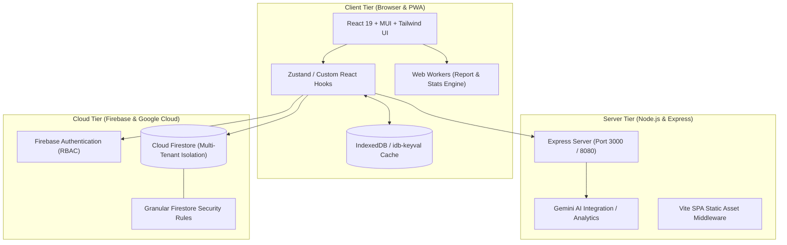
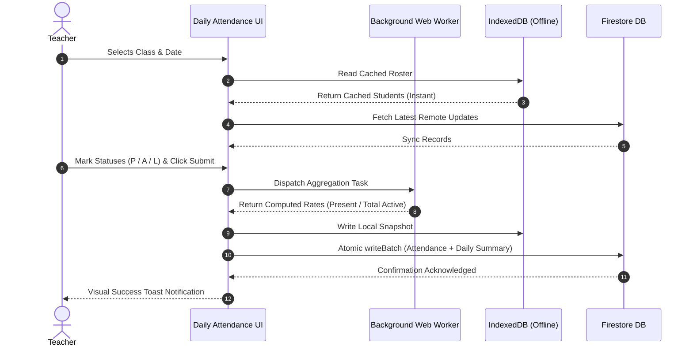

<div align="center">

# 🏫 EduSync • Classroom Manager & Attendance Suite

<p align="center">
  <b>Enterprise-Grade, Offline-Resilient School Administration & Real-Time Attendance Management Platform</b>
</p>

<p align="center">
  <a href="#-quick-tour"></a>
  <a href="#-features"></a>
  <a href="#-license"></a>
  <a href="https://github.com"></a>
</p>

<p align="center">
  
  
  
  
  
  
  
  
</p>

<br />

```
  ┌──────────────────────────────────────────────────────────────────────────┐
  │  🚀 REAL-TIME OVERSIGHT  │  ⚡ LIGHTNING FAST ATTENDANCE  │  🖨️ PDF EXPORTS │
  │  📊 MULTI-ROLE RBAC      │  🔒 ZERO-DATA-LOSS CACHING    │  📱 MOBILE CLIENT│
  └──────────────────────────────────────────────────────────────────────────┘
```

</div>

---

## 📑 Table of Contents

- [🌟 Highlights](#-highlights)
- [🏗️ System Architecture](#️-system-architecture)
- [✨ Key Features](#-key-features)
- [📊 Attendance Workflow & Calculation Engine](#-attendance-workflow--calculation-engine)
- [🧩 Tech Stack & Ecosystem](#-tech-stack--ecosystem)
- [📁 Project Structure](#-project-structure)
- [🚀 Quickstart & Installation](#-quickstart--installation)
- [⚙️ Environment Variables](#️-environment-variables)
- [🔒 Security & Multi-Tenant Architecture](#-security--multi-tenant-architecture)
- [📜 Scripts & Commands](#-scripts--commands)
- [🛣️ Roadmap & Releases](#️-roadmap--releases)
- [🤝 Contributing](#-contributing)
- [📄 License](#-license)

---

## 🌟 Highlights

<table>
<tr>
<td width="50%">

### ⚡ Sub-Second Daily Attendance
- Dedicated high-velocity capture mode for teachers.
- Rapid toggle between **Present (P)**, **Absent (A)**, and **Leave (L)**.
- Full keyboard and touch optimization.
- Instant batch submit with optimistic UI updates.

</td>
<td width="50%">

### 🛡️ Multi-Tier RBAC & Isolation
- **System Admin**: Multi-school tenant oversight, migration tools, database backups.
- **Principal / Oversight**: Real-time school strength, active rate metrics, cross-class analysis.
- **Teacher**: Dedicated class roster, leave approvals, monthly attendance sheets.

</td>
</tr>
<tr>
<td width="50%">

### 📅 High-Density Monthly Sheets
- High-performance matrix view for entire academic terms.
- Virtualized & memoized rendering supporting 1,000+ student classes.
- Real-time aggregation of TA (Total Attendance), PCA, and TCA.

</td>
<td width="50%">

### 🖨️ Automated PDF & Excel Reporting
- Client-side vector PDF generation with custom school letterheads.
- Official attendance register formatting with signature blocks.
- One-click CSV bulk import / export with schema validation.

</td>
</tr>
</table>

---

## 🏗️ System Architecture

The application adopts a **Modern Full-Stack Hybrid** architecture combining React 19 SPA rendering with dedicated Express proxy middlewares and Firebase Cloud Services:



---

## ✨ Key Features

### 1. 🎯 Precision Dashboard & Oversight Metrics
- **Dynamic School Strength**: Tracks `Total Active Enrolled Strength` vs `Today's Present Students`.
- **Accurate Capacity Rate**: Calculates live percentage based on total school capacity rather than partial submissions:
  $$\text{School Attendance Rate} = \left( \frac{\sum \text{Present Students}}{\sum \text{Active Enrolled Students}} \right) \times 100$$
- **Class-by-Class Breakdown**: Visual progress bars and health chips indicating marked, pending, and unmarked classrooms.

### 2. 📋 Interactive Attendance Matrix
- **Spreadsheet-style Editing**: Cell-level editing with immediate visual feedback.
- **Color-Coded Status Codes**:
  - `P` (Present) &rarr; <kbd>Leaf Green (#1b5e20)</kbd>
  - `A` (Absent) &rarr; <kbd>Dark Red (#b71c1c)</kbd>
  - `L` (Leave) &rarr; <kbd>Warm Orange (#e65100)</kbd>
  - `-` (Unmarked) &rarr; <kbd>Muted Gray</kbd>
- **Boarder vs. Day Scholar Classification**: Granular metrics categorized by student residence type (*Day Scholar*, *Day Boarder*, *Full Boarder*).

### 3. 📂 Student Profile Lifecycle Management
- Manage active vs. inactive student archives.
- Photo uploads with crop & camera capture support.
- Emergency contact information, blood groups, and medical remarks.
- Batch student onboarding via structured CSV templates.

---

## 📊 Attendance Workflow & Calculation Engine



---

## 🧩 Tech Stack & Ecosystem

```
Frontend Architecture         Backend & Persistence         Tooling & Build
─────────────────────         ─────────────────────         ───────────────
⚛️ React 19.0                 🔥 Firebase Firestore         ⚡ Vite 6.0
📘 TypeScript 5.0             🔐 Firebase Auth              📦 ESBuild (Server Bundle)
🎨 Tailwind CSS v4            🚀 Express.js                 📊 Recharts & D3
💎 Material UI (MUI) v9       💾 IndexedDB (idb-keyval)     📑 jsPDF & AutoTable
⚡ Lucide React Icons         🤖 Google GenAI (Gemini)      🧪 ESLint & TypeScript
```

---

## 📁 Project Structure

```bash
classroom-manager/
├── 📁 flutter/                     # Synchronized Flutter Mobile Client
├── 📁 public/                      # Static assets, icons, manifest.webmanifest
├── 📁 src/
│   ├── 📁 api/                     # Firebase API adapters & atomic transactions
│   │   ├── attendance.ts           # Attendance CRUD & summary aggregation
│   │   ├── auth.ts                 # Role authentication & user session
│   │   ├── classes.ts              # Classroom configuration & metadata
│   │   └── profiles.ts             # Student profile records
│   ├── 📁 components/              # Modular UI Component Library
│   │   ├── 📁 admin/               # Migration tools, user management, audit
│   │   ├── 📁 common/              # Buttons, modals, error boundaries, spinners
│   │   ├── 📁 dashboard/           # Oversight & Teacher dashboard widgets
│   │   ├── 📁 monthlyAttendance/   # High-density attendance grid & cells
│   │   └── 📁 navigation/          # Primary floating nav & secondary drawers
│   ├── 📁 hooks/                   # Custom business logic & data hooks
│   │   ├── useAttendanceData.ts    # Attendance query & mutation manager
│   │   ├── useProfilesData.ts      # Profile state cache & search
│   │   └── useRoleAccess.ts        # RBAC privilege evaluator
│   ├── 📁 pages/                   # Application route views
│   │   ├── Attendance.tsx          # Daily marking entrypoint
│   │   ├── Dashboard.tsx           # Primary analytics hub
│   │   ├── Profiles.tsx            # Student directory
│   │   └── Reports.tsx             # PDF / Excel generation suite
│   ├── 📁 workers/                 # Web Worker calculations (off-main-thread)
│   │   └── calculations/           # Stats, rates, and report generators
│   ├── App.tsx                     # Top-level routing & layout shell
│   └── main.tsx                    # Application bootstrap & provider tree
├── firestore.rules                 # Enterprise Firestore security rules
├── server.ts                       # Full-stack Node.js server entrypoint
├── Dockerfile                      # Cloud Run container deployment spec
└── package.json                    # Project manifest & scripts
```

---

## 🚀 Quickstart & Installation

<details open>
<summary><b>1. Prerequisites</b></summary>

- [Node.js](https://nodejs.org/) `>= 20.0.0`
- [npm](https://www.npmjs.com/) `>= 10.0.0`
- A configured [Firebase Project](https://console.firebase.google.com/) with **Firestore** and **Email/Password Auth** enabled.

</details>

<details open>
<summary><b>2. Installation Steps</b></summary>

```bash
# 1. Clone the repository
git clone https://github.com/your-org/classroom-manager.git
cd classroom-manager

# 2. Install all dependencies
npm install

# 3. Configure your local environment
cp .env.example .env

# 4. Start local development server
npm run dev
```

The application will be live at `http://localhost:3000`.

</details>

---

## ⚙️ Environment Variables

Configure the following environment variables in `.env` (or in your Cloud environment):

```ini
# ==============================================================================
# FIREBASE CLIENT CONFIGURATION
# ==============================================================================
VITE_FIREBASE_API_KEY=AIzaSy...
VITE_FIREBASE_AUTH_DOMAIN=your-project.firebaseapp.com
VITE_FIREBASE_PROJECT_ID=your-project
VITE_FIREBASE_STORAGE_BUCKET=your-project.appspot.com
VITE_FIREBASE_MESSAGING_SENDER_ID=123456789012
VITE_FIREBASE_APP_ID=1:123456789012:web:...

# ==============================================================================
# SERVER-SIDE AI & CLOUD SERVICES (Optional)
# ==============================================================================
GEMINI_API_KEY=AIzaSy...
PORT=3000
NODE_ENV=development
```

---

## 🔒 Security & Multi-Tenant Architecture

```
                                  [ Incoming Request ]
                                           │
                           ┌───────────────┴───────────────┐
                           ▼                               ▼
                 [ Platform Admin ]                [ School Admin / Teacher ]
                 • Universal access                • Tenant-scoped access only
                 • DB maintenance                  • Locked to schoolId in token
                 • Migration tools                 • Cannot query other schools
                           │                               │
                           └───────────────┬───────────────┘
                                           ▼
                            [ Firestore Security Rules ]
                       Enforces match /schools/{schoolId}
```

- **Strict Tenant Isolation**: All student documents, attendance records, and class rosters reside under `schools/{schoolId}/*`.
- **Role Verification**: Firestore rules enforce user claims matching the active `schoolId`.
- **No Client API Keys for AI**: All Gemini AI capabilities are executed server-side via `server.ts` to keep credentials secure.

---

## 📜 Scripts & Commands

| Command | Action | Description |
| :--- | :--- | :--- |
| `npm run dev` | **Development** | Starts the full-stack dev server using `tsx` on port `3000`. |
| `npm run build` | **Production Build** | Runs `vite build` + bundles `server.ts` into `dist/server.cjs` via `esbuild`. |
| `npm start` | **Production Run** | Boots the compiled production container via `node dist/server.cjs`. |
| `npm run lint` | **Type Checking** | Executes `tsc --noEmit` to validate strict TypeScript compilation. |

---

## 🛣️ Roadmap & Releases

- [x] **v1.0** — Core daily attendance engine with Present / Absent / Leave markers.
- [x] **v1.2** — Full IndexedDB offline synchronization and resilient local queue.
- [x] **v1.5** — High-performance monthly sheet matrix with virtualized cell rendering.
- [x] **v1.8** — Multi-school tenant isolation and administrative migration suite.
- [x] **v2.0** — Web Worker calculation engine for non-blocking UI aggregations.
- [ ] **v2.1** — Automated SMS / WhatsApp absentee notifications to parents.
- [ ] **v2.2** — Biometric fingerprint & RFID reader integration gateway.

---

## 🤝 Contributing

Contributions make the open-source community an amazing place to learn, inspire, and create. Any contributions you make are **greatly appreciated**.

1. Fork the Project (`https://github.com/your-org/classroom-manager/fork`)
2. Create your Feature Branch (`git checkout -b feature/AmazingFeature`)
3. Commit your Changes (`git commit -m 'feat: Add some AmazingFeature'`)
4. Push to the Branch (`git push origin feature/AmazingFeature`)
5. Open a Pull Request

---

<div align="center">

**Built with ❤️ for educators, administrators, and modern classrooms worldwide.**

<br />

[](#-edusync--classroom-manager--attendance-suite)

</div>
